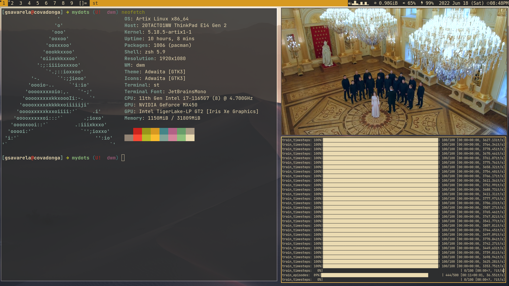
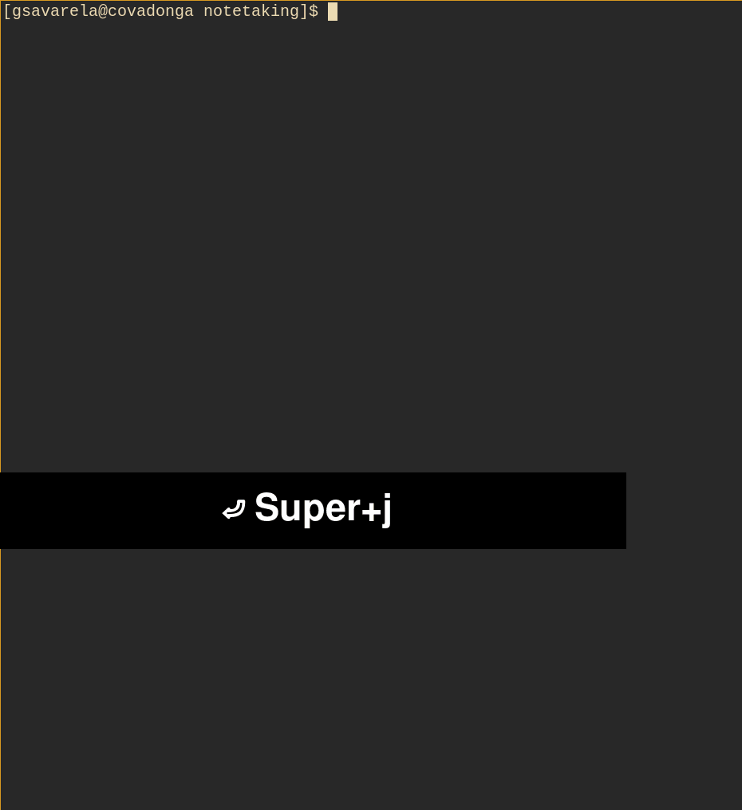
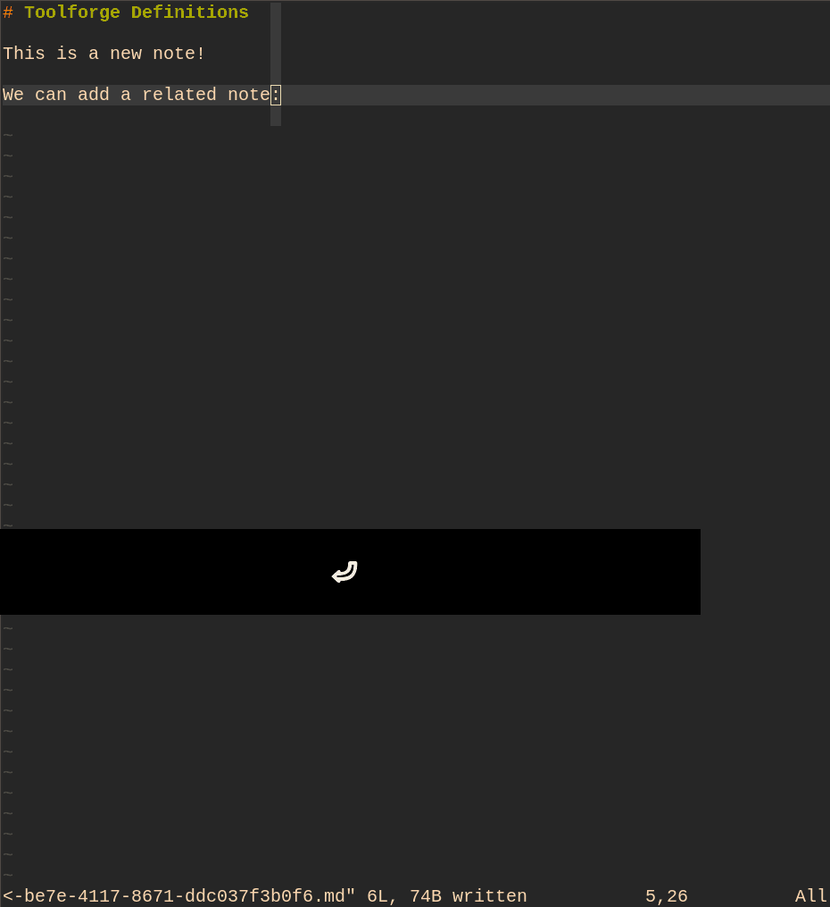
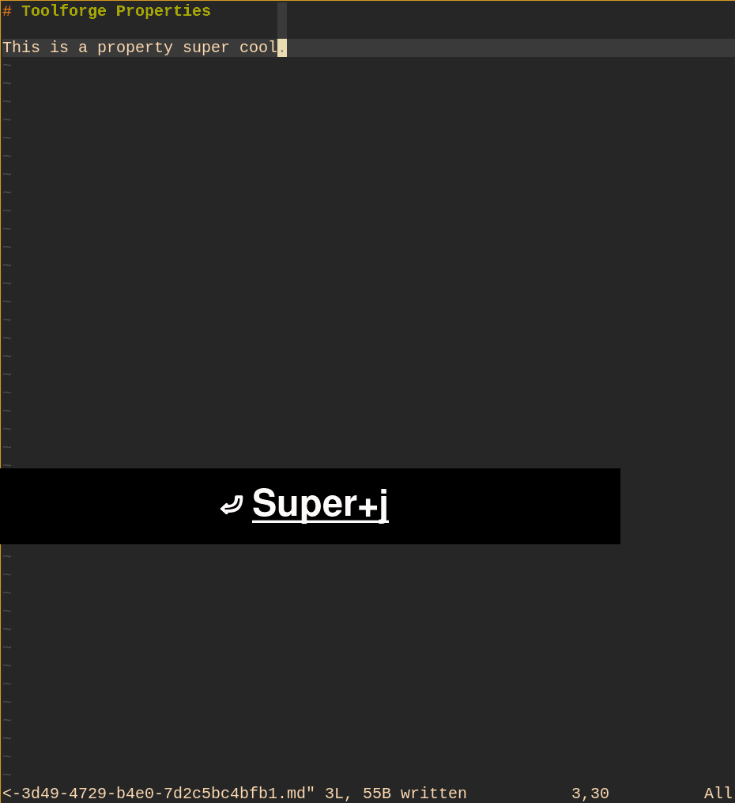
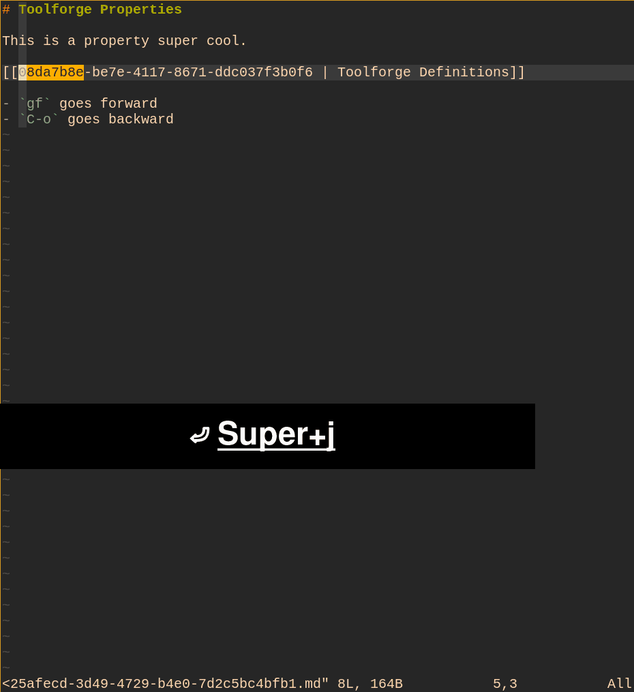
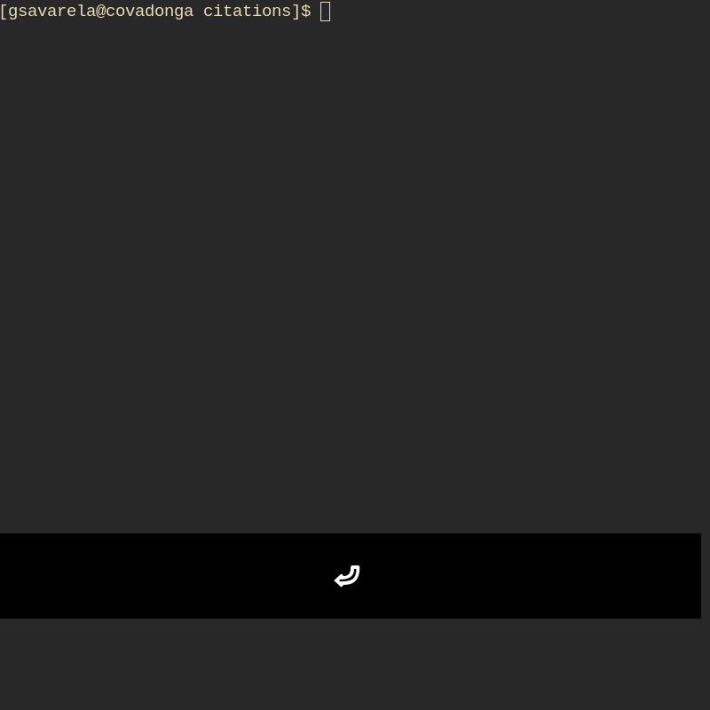

# Mydots



1. [Installation](#installation)
2. Window Manager: [Dwm](#dwm)
    - Terminal: [suckless terminal](https://st.suckless.org/)
    - Status Bar: [dwmblocks-async](#dwmblocks-async)
    - Fonts: [Font](#font)
3. Editors:
    - [Neovim as IDE](#neovim_as_ide)
    - [Vim for notetaking](#vim_for_notetaking)
4. Shell: [Zsh](#zsh)
5. Notifications: [Dunst](https://dunst-project.org/) 
6. [TODO](#TODO)
---
# 1. Installation<a name="installation"></a> 

Those are my dot files so far.. this is a work in progress hence it may break.

## Requirements

You will need `git`, GNU `stow` and [XDG Base Directory](https://wiki.archlinux.org/title/XDG_Base_Directory)


## Download

`cd` into a directory of your choice


```
git clone https://github.com/gsavarela/mydots.git && cd mydots

```

## Compile Suckless Tools

```
cd sources && cd dwm && sudo make clean install
cd .. && cd dwmblocks && sudo make clean install
cd .. && cd st && sudo make clean install
cd ../..

```

## Stow 

Run stow to symlink everything or just select what you want

```

### Everything (-I flag to ignore source)

stow -R $(ls -Idocs -Isources -Ipatches -IREADME.md) -t ~

### Just my dwm config
stow dwm 

```
---
# 2. Dwm

## Dwmblocks-async<a name="dwmblocks-async"></a> 


A modular statusbar for `dwm` written in C. You may think of it as `i3blocks`, but for `dwm`.
Credits to [UtkarshVerma](https://github.com/UtkarshVerma/dwmblocks-async) 


### Features
- Modular
- Lightweight
- Suckless
- Blocks are clickable
- Blocks are loaded asynchronously
- Each block can be externally triggered to update itself
- Compatible with `i3blocks` scripts


### Why `dwmblocks`?
In `dwm`, you have to set the statusbar through an infinite loop like this:

```sh
while :; do
    xsetroot -name "$(date)"
    sleep 30
done
```

It may not look bad as it is, but it's surely not the most efficient way when you've got to run multiple commands, out of which only few need to be updated as frequently as the others. 

```sh
# Displaying an unread mail count in the status bar
while :; do
    xsetroot -name "$(mailCount) $(date)"
    sleep 60
done
```

For example, I display an unread mail count in my statusbar. Ideally, I would want this count to update every thirty minutes, but since I also have a clock in my statusbar which has to be updated every minute, I can't stop the mail count from being updated every minute.

As you can see, this is wasteful. And since my mail count script uses Gmail's APIs, there's a limit to the number of requests I can make, being a free user.  

What `dwmblocks` does is that it allows you to break up the statusbar into multiple blocks, each of which have their own update interval. The commands in a particular block are only executed once in that interval. Hence, we don't run into our problem anymore.

What's even better is that you can externally trigger updation of any specific block.


### Why `dwmblocks-async`?

Everything I have mentioned till now is offered by the vanilla `dwmblocks`, which is fine for most users. What sets `dwmblocks-async` apart from vanilla `dwmblocks` is the 'async' part. `dwmblocks` executes the commands of each blocks sequentially which means that the mail and date blocks, from above example, would be executed one after the other. This means that the date block won't update unless the mail block is done executing, or vice versa. This is bad for scenarios where one of the blocks takes seconds to execute, and is clearly visible when you first start `dwmblocks`.

This is where the async nature of `dwmblocks-async` steps in tells the computer to execute each block asynchronously or simultaneously.

### Modifying the blocks
You can define your statusbar blocks in `config.h`. Each block has the following properties:

Property|Value
-|-
Command | The command you wish to execute in your block
Update interval | Time in seconds, after which you want the block to update. Setting this to `0` will result in the block never being updated.
Update signal | Signal to be used for triggering the block. Must be a positive integer. If the value is `0`, signal won't be set up for the block and it will be unclickable.

The syntax for defining a block is:
```c
const Block blocks[] = {
    ...
    BLOCK("volume", 0,    5),
    BLOCK("date",   1800, 1),
    ...
}
```

Apart from that you can also modify the following parameters to suit your needs.
```c
// Maximum possible length of output from block, expressed in number of characters.
#define CMDLENGTH 50

// The status bar's delimiter which appears in between each block.
#define DELIMITER " "

// Adds a leading delimiter to the statusbar, useful for powerline.
#define LEADING_DELIMITER

// Enable clickability for blocks. Needs `dwm` to be patched appropriately.
// See the "Clickable blocks" section below.
#define CLICKABLE_BLOCKS
```

### Signalling changes
Most statusbars constantly rerun every script every several seconds to update. This is an option here, but a superior choice is giving your block a signal that you can signal to it to update on a relevant event, rather than having it rerun idly.

For example, the volume block has the update signal 5 by default.  Thus, running `pkill -RTMIN+5 dwmblocks` will update it.

You can also run `kill -39 $(pidof dwmblocks)` which will have the same effect, but is faster. Just add 34 to your typical signal number.

My volume block *never* updates on its own, instead I have this command run along side my volume shortcuts in `dwm` to only update it when relevant.

Note that all blocks must have different signal numbers.

Apart from this, you can also refresh all the blocks by sending `SIGUSR1` to `dwmblocks-async` using either `pkill -SIGUSR1 dwmblocks` or `kill -10 $(pidof dwmblocks)`.

### Clickable blocks
Like `i3blocks`, this build allows you to build in additional actions into your scripts in response to click events. You can check out [my statusbar scripts](https://github.com/UtkarshVerma/dotfiles/tree/main/.local/bin/statusbar) as references for using the `$BLOCK_BUTTON` variable.

To use this feature, define the `CLICKABLE_BLOCKS` feature macro in your `config.h`.
```c
#define CLICKABLE_BLOCKS
```

Apart from that, you need `dwm` to be patched with [statuscmd](https://dwm.suckless.org/patches/statuscmd/).
---
# Installed fonts<a name="fonts"></a> 
Two good sources: [Suckless Terminal and Fonts](https://github.com/LukeSmithxyz/voidrice/issues/284) and [MachOS](https://github.com/Mach-OS/Machfiles) 

```
    ttf-bitstream-vera 1.10-14
    ttf-font-awesome 6.1.1-1
    ttf-linux-libertine 5.3.0-8
    ttf-nerd-fonts-symbols 2.1.0+36+gd0bf73a1-4
    ttf-symbola 13.00-8
```
---
## Neovim as IDE <a name="neovim_as_ide"></a> 


## Vim for Notetaking <a name="vim_for_notetaking"></a> 

The current installation of vim is as minimal as possible, as opposed to the neovim installation, and is taylored towards writting notes using the well known [Zettelkasten Method](https://zettelkasten.de/introduction/).
Vim also serves as the utility for as mergetool, just can't live without fugitive, and official CLI editor.

### Vim as Zettelkasten.

The current setup mostly uses the excelent scripts by [joakin/vim](https://github.com/joakin/.vim) and his [tutorial](https://www.youtube.com/watch?v=u8jvUaqadsg).

#### 1. NewNote
Start writing using the command `:NewNote` and passing a header:
<br />

<br />
#### 2. The next (related) note.
From within the note it's often convinent to add a new note:
<br />

<br />

#### 3. Linking both notes.
We can now link both notes using `:NoteLink`
<br />

<br />

#### 4. Note Navigation
Use the `go to file` shortcut `gf` and `Ctrl+o` to go back.
<br />

<br />

#### 5. Searching for backlinks.
Use the command `:NoteReferences` and select the link.
<br />

<br />

See also his tutorials.

### Vim for reference notes.

One aspect of the Zettelkasten method is to make reference notes that outline the contents of an article. The vim-pandoc plugin provides for easy citation within a
markdown file. Just drop the bib file containing the bibliography information and a reference markdown file containing the header: 
```
---
title: Reading notes
author: Author Name
bibliography: /path/to/references.bib
abstract: Reading notes with references
---
```

Now by typing `[@` and typing `Ctrl+X+O` we can omini-complete our bibliography files. 
<br />

<br />

### Vim as Mergetool.


## Zsh<a name="zsh"></a> 

The reference is the [Matchfiles](https://github.com/Mach-OS/Machfiles) repo.

- Muh plugin manager -- it's just a shell function.
- Vim mode.
- Synthax high-lighting.
- Code completion.
- Sane `zsh/` directory vs. monolithic `.bashrc`.

# TODO

- [] Switch to [xrdb patch](https://dwm.suckless.org/patches/xrdb/) for theme switching
- [] Fix the issue with hardcoded path
- [] Create a list of keybindings
- [ ] Explain installation procedure and how everything works
	- [] Mention the mandatory and optional dependencies
	- [ ] Make a basic guide
	- [ ] Make a detailed guide
	- [ ] Make guides for fedora and debian
- [] Scripts for detecting mountable and unmountable paths
